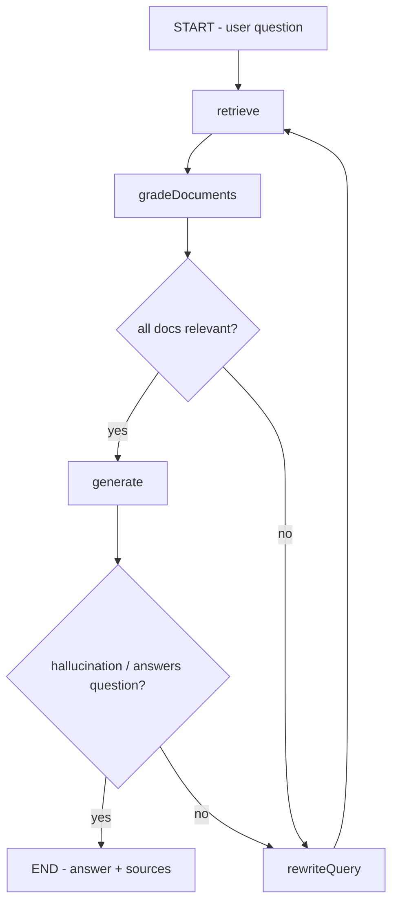

# Plan: Factory Software Design Q&A Chatbot with RAG

## 1. Objective

Build a domain-specific Chatbot Q&A system using **LangChain/LangGraph** that performs Retrieval-Augmented Generation over business documents from the **software design industry for factories** (e.g. SRS documents, architecture specs, MES/SCADA design docs, interface specifications).

The system ingests PDF/DOCX/Markdown documents, chunks and embeds them into **PostgreSQL + pgvector**, and answers user questions via a LangGraph workflow that retrieves relevant context and generates grounded answers, exposed through a **REST API (Fastify)**.

## 2. Key Decisions

| Concern            | Choice                                                        |
| ------------------ | ------------------------------------------------------------ |
| Language           | TypeScript (existing workspace, `module: nodenext`)          |
| LLM                | OpenRouter via `@langchain/openai` `ChatOpenAI` (reuse env)  |
| Embeddings         | OpenRouter/OpenAI-compatible embeddings API                  |
| Vector Store       | PostgreSQL + `pgvector` (via `@langchain/community` `PGVector`) |
| Doc Loaders        | PDF, DOCX, Markdown                                          |
| Orchestration      | LangGraph `StateGraph`                                       |
| API Layer          | Fastify REST API (`POST /chat`, `POST /ingest`, `GET /health`) |
| Config             | `.env` + typed config module                                 |

## 3. Target Project Structure

```
langgraph-fundamentals/
├── src/
│   ├── index.ts                  # Entry point: boots Fastify server
│   ├── config/
│   │   └── env.ts                # Typed env loading + validation
│   ├── state.ts                  # LangGraph state (RAG schema)
│   ├── graph.ts                  # StateGraph compilation (retrieve → grade → generate)
│   ├── nodes/
│   │   ├── retrieve.ts           # Vector store similarity search
│   │   ├── gradeDocuments.ts     # Relevance grading of retrieved docs
│   │   ├── generate.ts           # Final answer synthesis with citations
│   │   └── rewriteQuery.ts       # Query rewrite on low relevance
│   ├── chains/
│   │   ├── llm.ts                # Shared ChatOpenAI (OpenRouter) instance
│   │   └── embeddings.ts         # Shared embeddings instance
│   ├── ingestion/
│   │   ├── loader.ts             # PDF/DOCX/MD document loaders
│   │   ├── splitter.ts           # Recursive text splitter config
│   │   └── ingest.ts             # Orchestrates load → split → embed → store
│   ├── vectorstore/
│   │   └── pgvector.ts           # PGVector store init + retrieval helpers
│   ├── prompts/
│   │   ├── ragPrompt.ts          # Domain-tuned Q&A system prompt
│   │   ├── gradePrompt.ts        # Document relevance grading prompt
│   │   └── rewritePrompt.ts      # Query rewrite prompt
│   ├── server/
│   │   ├── app.ts                # Fastify app setup + route registration
│   │   └── routes/
│   │       ├── chat.ts           # POST /chat
│   │       ├── ingest.ts         # POST /ingest
│   │       └── health.ts         # GET /health
│   └── utils/
│       └── logger.ts             # Structured logging (pino)
├── data/
│   └── documents/                # Sample/seed factory design docs
├── scripts/
│   └── seed.ts                   # Ingest seed documents into pgvector
├── docker-compose.yml            # PostgreSQL + pgvector service
├── sql/
│   └── init.sql                  # Enable pgvector extension + table
├── .env.example
├── package.json
├── tsconfig.json
└── README.md
```

> The existing demo files (`graph.ts`, `node.ts`, `state.ts`, `index.ts`) will be repurposed: `state.ts` becomes the RAG state, `graph.ts` becomes the RAG graph, `node.ts` is split into `nodes/`, and `index.ts` starts the server.

## 4. LangGraph Workflow



### State Schema (`src/state.ts`)

```typescript
export const GraphState = Annotation.Root({
  question: Annotation<string>(),
  documents: Annotation<Document[]>({ reducer: defaultReducer }),
  rewrittenQuestion: Annotation<string>(),
  generation: Annotation<string>(),
  sources: Annotation<string[]>({ default: () => [] }),
});
```

### Nodes

1. **retrieve** — `pgvector.similaritySearchWithScore(question, k=4)`
2. **gradeDocuments** — LLM grades each doc `relevant | not relevant`; filters.
3. **generate** — RAG chain: system prompt (factory software-design domain expert) + retrieved context → answer with inline source citations.
4. **rewriteQuery** — rephrase question for better retrieval when context is weak (loops back, max iterations guarded).

### Conditional Edges

- After `gradeDocuments`: if zero relevant docs → `rewriteQuery`; else → `generate`.
- After `generate`: light self-check (does answer address question); if not → `rewriteQuery`.

## 5. Domain-Specific Tuning (Factory Software Design)

The system prompt positions the assistant as an expert in **industrial/factory software design**, fluent in:

- MES (Manufacturing Execution Systems), SCADA, PLC integration
- ISA-95 / ISA-88 standards
- Equipment connectivity (OPC-UA, Modbus)
- Batch & continuous process design
- Software architecture for factory floor (edge/gateway/plant levels)

The prompt instructs the model to cite source filenames/sections and to state clearly when the knowledge base lacks an answer (no hallucination).

## 6. Ingestion Pipeline

`src/ingestion/ingest.ts`:

1. Resolve file path(s) from `data/documents/`.
2. Dispatch to loader by extension:
   - `.pdf` → `PDFLoader`
   - `.docx` → `DocxLoader`
   - `.md` → `TextLoader`
3. `RecursiveCharacterTextSplitter` (chunkSize 1000, overlap 200).
4. Attach metadata: `{ source, docType, section }`.
5. `PGVector.addDocuments(vectors)`.

## 7. API Surface (Fastify)

| Method | Route      | Body                                     | Returns                                  |
| ------ | ---------- | ---------------------------------------- | ---------------------------------------- |
| POST   | `/chat`    | `{ "question": string, "sessionId"?: string }` | `{ "answer": string, "sources": [] }`    |
| POST   | `/ingest`  | `{ "path": string }` or multipart file   | `{ "ingested": n, "source": string }`    |
| GET    | `/health`  | —                                        | `{ "status": "ok" }`                     |

Streaming support (`text/event-stream`) for `/chat` is a future enhancement.

## 8. Infrastructure

### `docker-compose.yml`

- Service `postgres` with `pgvector/pgvector:pg16` image.
- Volume for persistence.
- Mounts `sql/init.sql` to `/docker-entrypoint-initdb.d/`.

### `sql/init.sql`

```sql
CREATE EXTENSION IF NOT EXISTS vector;
```

(PGVector store class manages its own table `documents`.)

## 9. New Dependencies

```
fastify
@fastify/multipart
@langchain/community         # PGVector, document loaders
pg                          # peer of PGVector
pgvector                    # type helpers
pino                        # logging
zod                         # env + request validation
langchain                   # core text splitter, document types
```

Dev:
```
@types/pg
```

## 10. Actionable Todo List

- [ ] Add dependencies to `package.json` and install
- [ ] Create `docker-compose.yml` + `sql/init.sql` for pgvector
- [ ] Create `.env.example` (OpenRouter keys, PG connection string, embedding model)
- [ ] Build `src/config/env.ts` with zod-validated config
- [ ] Implement `src/chains/llm.ts` (ChatOpenAI via OpenRouter) and `src/chains/embeddings.ts`
- [ ] Implement `src/vectorstore/pgvector.ts` (init store + retriever)
- [ ] Implement ingestion: loaders (`loader.ts`), splitter (`splitter.ts`), `ingest.ts`
- [ ] Create domain prompts in `src/prompts/` (rag, grade, rewrite)
- [ ] Refactor `src/state.ts` to RAG state schema
- [ ] Implement nodes: `retrieve`, `gradeDocuments`, `generate`, `rewriteQuery`
- [ ] Compile graph in `src/graph.ts` with conditional edges
- [ ] Build Fastify app + routes (`/chat`, `/ingest`, `/health`)
- [ ] Update `src/index.ts` to start server
- [ ] Add `scripts/seed.ts` to ingest sample documents
- [ ] Add sample factory design docs to `data/documents/`
- [ ] Update `README.md` (setup, env, run, API usage)
- [ ] Smoke-test: `docker compose up`, run seed, hit `/chat`

## 11. Out of Scope (Future Work)

- Multi-turn conversational memory (checkpoints via LangGraph persistence)
- File upload UI / chat web frontend
- Streaming SSE responses
- RBAC / authentication on API
- Hybrid search (keyword + vector) and reranking
